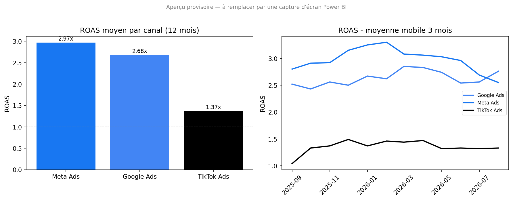

# Dashboard de performance des campagnes marketing

## Contexte
Analyse des dépenses publicitaires d'une entreprise e-commerce fictive sur trois canaux
(Google Ads, Meta Ads, TikTok Ads) sur 12 mois (septembre 2025 – août 2026), à partir d'un
export brut simulé de type "Marketing Campaign Performance" — volontairement "sale"
(doublons, formats de devise mélangés, valeurs manquantes) pour reproduire un vrai cas de
nettoyage de données.

## Question business
Quel canal publicitaire génère le meilleur retour sur investissement (ROAS), et comment le
budget mensuel devrait-il être réalloué entre les trois canaux ?

## Démarche
1. **Nettoyage (SQL — `queries/01_nettoyage.sql`)** : suppression des doublons de campagnes
   (repérés avec `ROW_NUMBER() OVER (PARTITION BY campaign_id ...)`), normalisation des
   montants de dépense (formats mixtes `"EUR 1234.56"` / `"1234.56€"` / `"1234.56"`),
   normalisation des noms de canal (casse et variantes), exclusion des lignes avec 0 clic
   (bug d'export), et recalcul du CPC manquant (`spend / clicks`) plutôt que de le laisser vide.
2. **Analyse (SQL — `queries/02_indicateurs.sql`)** : calcul du ROAS, du CPA (coût par
   acquisition) et du taux de conversion par canal et par mois, plus une moyenne mobile sur
   3 mois du ROAS (fenêtrage `AVG() OVER (PARTITION BY channel ORDER BY mois ROWS BETWEEN 2
   PRECEDING AND CURRENT ROW)`) pour lisser les variations mensuelles et voir la tendance de fond.
3. **Visualisation (Power BI)** : dashboard interactif avec filtre par période et par canal
   (voir `GUIDE_POWER_BI.md` pour la construction pas à pas à partir des tables générées par
   les requêtes SQL ci-dessus).

## Résultat
Sur les 12 mois analysés (237 049 € dépensés, 595 555 € de revenu généré, ROAS global 2.51x) :

| Canal | Dépense totale | ROAS moyen | CPA moyen | Taux de conversion |
|---|---|---|---|---|
| **Meta Ads** | 82 515 € | **2.97x** | 19.60 € | 2.85 % |
| Google Ads | 105 963 € | 2.68x | 16.04 € | **5.27 %** |
| TikTok Ads | 48 570 € | **1.37x** | 20.56 € | 1.69 % |

Meta Ads affiche le meilleur ROAS moyen (2.97x), suivi de près par Google Ads (2.68x), qui
reste cependant le canal le plus efficace pour la conversion pure (taux de conversion de
5.27 %, plus de 3 fois supérieur aux deux autres canaux). TikTok Ads est nettement en retrait
(ROAS 1.37x, sous la moyenne des deux autres canaux) et n'est jamais repassé au-dessus de
1.5x sur les 12 mois (voir la moyenne mobile 3 mois dans le dashboard).

**Recommandation** : réallouer environ 15 % du budget TikTok Ads (~7 300 €) vers Meta Ads et
Google Ads — Meta Ads pour maximiser le ROAS global, Google Ads sur les campagnes de
conversion pour capitaliser sur son meilleur taux de conversion.

*(Image provisoire générée à partir des données — à remplacer par une vraie capture d'écran
une fois le dashboard construit dans Power BI, voir `GUIDE_POWER_BI.md`.)*

## Ce que j'ai appris
Premier vrai usage des fonctions de fenêtrage SQL (`ROW_NUMBER() OVER`, `AVG() OVER (... ROWS
BETWEEN 2 PRECEDING AND CURRENT ROW)`) — utile à la fois pour dédupliquer proprement des
données (au lieu d'un `DISTINCT` qui aurait aussi supprimé de vraies campagnes similaires) et
pour calculer une moyenne mobile directement en SQL plutôt que de le refaire ensuite dans
Power BI. Le nettoyage des formats de devise mélangés m'a aussi fait comprendre l'intérêt de
toujours valider le type des colonnes après un import (`spend` arrivait en texte, pas en
nombre, à cause des quelques lignes avec `"EUR"` ou `"€"`).

## Outils
`SQL (SQLite)` `Power BI` `Python (génération du jeu de données)`

## Structure du repo
- `data/campagnes_marketing_raw.csv` — export brut (avec les problèmes de qualité à nettoyer)
- `data/campagnes_clean.csv`, `data/indicateurs_mensuels.csv`, `data/synthese_par_canal.csv` — résultats des requêtes SQL, prêts à importer dans Power BI
- `queries/01_nettoyage.sql` — nettoyage et normalisation
- `queries/02_indicateurs.sql` — calcul des indicateurs (ROAS, CPA, taux de conversion, moyenne mobile)
- `dashboard/` — capture d'écran du dashboard Power BI
- `GUIDE_POWER_BI.md` — construction du dashboard pas à pas
